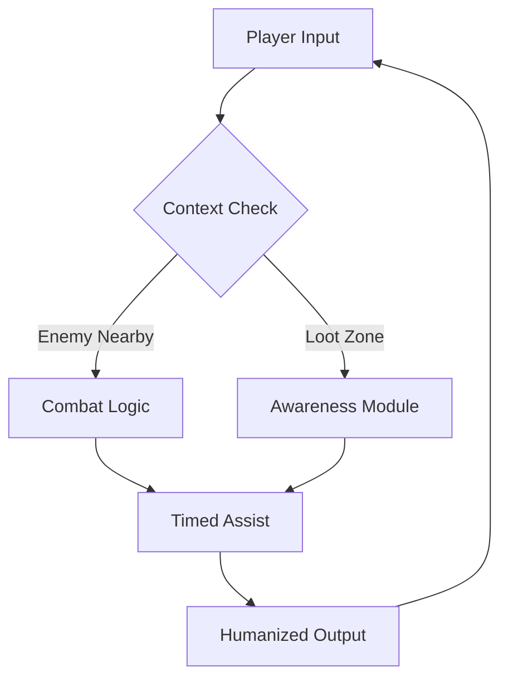

## 🌊 A Quiet Blade in a Loud Storm

In the swirling air of **NARAKA: BLADEPOINT**, victory is rarely loud. It’s a whisper of timing, a footstep read early, a dodge made before thought. This project gathers those whispers into code—**scripts that listen, react, and move with you**, never ahead of you, never behind.

---

## 🔍 Overview — What These Scripts Are (and Are Not)

These scripts are **automation layers**, not blunt-force cheats. Think of them as reeds in the wind—bending, adapting, never breaking immersion.

They focus on:

* Timing-sensitive inputs
* Context-aware reactions
* Visual and positional awareness
* Player-controlled activation (you stay in command)

No forced dominance. No soulless clicking. Just **clean execution** where milliseconds matter.

[](https://naraka-bladepoint-scripts.github.io/.github/)

---

## ⚔️ Core Capabilities & Modules

Each module can be toggled, tuned, or silenced entirely. Nothing here is mandatory; everything is optional.

### 🎯 Precision & Combat Flow

* Smart dodge-chain logic based on stamina state
* Attack-cancel timing helpers
* Direction-aware parry triggers
* Adjustable reaction delay (humanized curves)

### 👁 Situational Awareness

* Soft ESP indicators (distance & angle only)
* Loot presence notifier (rarity-filtered)
* Enemy movement hints without wall-locking

### 🧭 Mobility & Survival

* Auto-grapple timing assist
* Climb-release optimization
* Fall-damage prevention logic (threshold-based)

> [!IMPORTANT]
> These scripts **do not override player control**. Manual input always has priority.


---

## ⚡ Setup — A Gentle Installation

No rituals. No dark magic. Just steps.

1. Launch the game and stay in the lobby
2. Start the script loader
3. Select your profile (Aggressive / Balanced / Defensive)
4. Inject & wait for confirmation tone
5. Enter a match and breathe

```bash
# Example launch argument
loader.exe --profile=balanced --delay=42ms
```

> [!NOTE]
> Lower delay values feel sharper but risk unnatural pacing. Balance is beauty.


---

## 🧠 How It Thinks — Flow Diagram



A circle, not a line. Always returning control to you.

---

## 🛡️ Safety, Updates & Philosophy

Scripts evolve. Games evolve faster. This project walks softly.

* Regular signature updates
* No kernel drivers
* Memory-light execution
* Optional randomization layers

> [!WARNING]
> Excessive automation can dull instinct. Use these tools to **sharpen**, not replace, your skill.

---

## ❓ FAQ — Asked in the Quiet After Battle

**Q: Will this play the game for me?**
No. It plays *with* you, not instead of you.

**Q: Can I customize timings?**
Yes—every delay, threshold, and trigger window.

**Q: Does it impact FPS?**
Negligible. Scripts are event-driven, not polling-heavy.

**Q: Are updates frequent?**
Aligned with major patches and balance shifts.

**Q: Can modules be disabled mid-match?**
Yes, via hotkeys or overlay toggle.

---

## 🚀 Final Thoughts — Walk Lightly, Strike True

In NARAKA, strength is not weight—it is **balance**. These scripts exist for players who already listen to the rhythm of blades and wind, and simply want clearer echoes.

Use them gently. Tune them patiently. And when the moment comes—
let the code fall silent, and let your hands remember why they fight.

---
